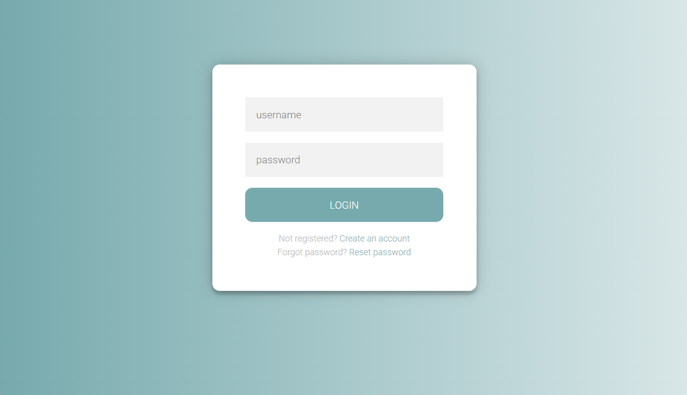

# Expense-Tracker

## Overview

***Expense-Tracker*** is a web application built with JSP/Servlet. 
It enables users to create an account with their email, categorize and log their daily expenses, and easily track their spending online.

## Environment

- Java SE 8
- Eclipse IDE
- Tomcat 9

## Features

- Use MVC model
- Account will be freezed after three failed login attempts
- Users can register, log in, log out, and reset passwords
- A verification email is sent upon successful registration or password changed
- The number of online users is displayed
- Records can be added, viewed, updated, and deleted
- PreparedStatement is used to prevent SQL injection

